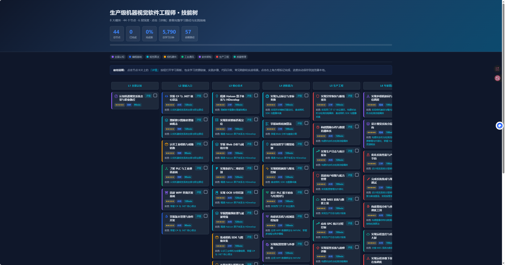
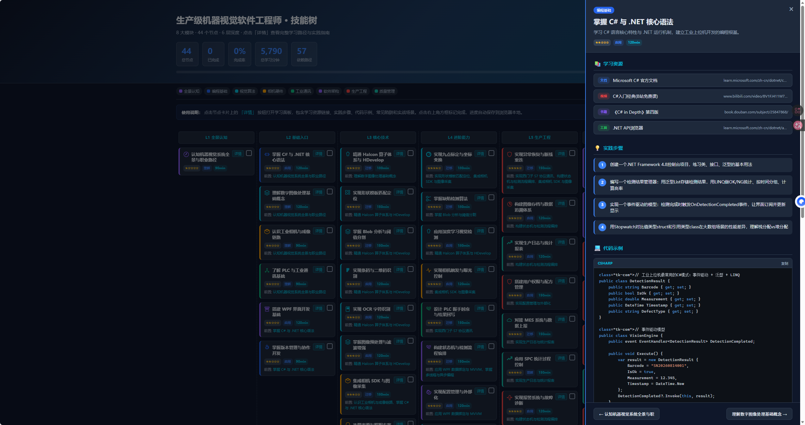

# 生产级机器视觉软件工程师 · 技能树

> 面向工业机器视觉上位机开发的完整技能体系，覆盖从入门到专家级的 62 个技能节点，包含学习资源、实践步骤、代码示例与实战场景。



## 项目简介

本项目是一棵**生产级机器视觉软件工程师技能树**，以交互式可视化页面的形式呈现完整的职业技能成长路径。每个技能节点都包含：

- **学习资源**：官方文档、视频课程、书籍、社区论坛
- **实践步骤**：4 步递进式实操指南
- **代码示例**：C# / HDevelop / XML / Bash 真实工程代码
- **常见陷阱**：实际项目中踩过的坑及解决方案
- **实战场景**：工厂产线真实应用案例



## 技能树结构

### 8 大模块

| 模块 | 颜色 | 说明 |
|------|------|------|
| 全景认知 | 紫色 | 机器视觉系统全貌、职业路径、工业检测链路 |
| 编程基础 | 蓝色 | C# / .NET、多线程、Git 版本管理、WinForm |
| 视觉算法 | 青色 | Halcon 算子、OpenCV、VisionPro、模板匹配、Blob 分析、条码 OCR、缺陷检测、深度学习 |
| 相机硬件 | 橙色 | 海康/大华工业相机 SDK、光源控制、镜头选型、触发模式 |
| 工业通讯 | 绿色 | 西门子 S7、倍福 ADS、汇川 MC、串口通信 RS232/RS485 |
| 软件架构 | 紫色 | WPF / MVVM、状态机、分层架构、设计模式、反射插件化、MySQL 分级存储、设备驱动热插拔 |
| 生产工程 | 红色 | 异常恢复、数据追溯、现场调试、远程运维 |
| 质量管理 | 青绿色 | SPC 统计过程控制、MES 对接、日志报表、看板大屏 |

### 6 层深度

| 层级 | 名称 | 定位 |
|------|------|------|
| L1 | 全景认知 | 建立系统全貌与职业方向 |
| L2 | 基础入口 | 编程语言、图像处理、硬件认知 |
| L3 | 核心技术 | Halcon 算法、相机 SDK、PLC 通讯、串口通信 |
| L4 | 进阶能力 | 状态机、多线程、设计模式、MySQL 分级存储 |
| L5 | 生产工程 | 异常恢复、反射插件化、设备驱动热插拔 |
| L6 | 专家精通 | 多相机协同、插件化架构、远程运维、性能调优 |

### 推荐深度等级

每个节点标注了推荐掌握深度，参照 Bloom 认知层次模型：

- **Recognize（识别）**：能辨认概念和术语
- **Understand（理解）**：能解释原理和边界
- **Use（应用）**：能独立完成实操
- **Transfer（迁移）**：能在新场景中重新应用
- **DeepMastery（精通）**：能优化和创新

## 功能特性

- **交互式技能树**：6 列层级布局，62 个可点击技能卡片
- **详情学习面板**：点击节点打开侧滑面板，展示完整学习内容
- **代码语法高亮**：支持 C# / HDevelop / XML / Bash 四种语言
- **进度跟踪**：勾选已完成节点，自动保存到浏览器本地存储
- **节点导航**：面板内支持上一个/下一个快速切换
- **分类筛选**：按 8 大模块快速定位技能节点
- **响应式布局**：适配不同屏幕宽度

## 技术栈

| 领域 | 技术 |
|------|------|
| 编程语言 | C# / .NET Framework 4.8 / WinForm / WPF |
| 视觉库 | Halcon / OpenCV (C++ & OpenCVSharp) / VisionPro / PCL 点云库 |
| 界面框架 | WPF + MVVM / WinForm |
| 相机 SDK | 海康威视 MVS SDK / 大华 MVViewer SDK |
| PLC 通讯 | HslCommunication (西门子 S7 / 倍福 ADS / 汇川 MC) |
| 串口通信 | RS232 / RS485 / SerialPort |
| 数据库 | MySQL + SQLite 本地缓存分级存储 |
| 深度学习 | ONNX Runtime |
| 实时通讯 | SignalR (远程监控看板) |
| 架构设计 | 反射插件化、工厂模式、策略模式、观察者模式、设备驱动热插拔 |
| 前端展示 | HTML5 + CSS3 + 原生 JavaScript |

## JD 对标覆盖

本项目基于真实岗位 JD 需求构建，完整覆盖以下核心要求：

| JD 要求 | 对应技能节点 | 状态 |
|---------|------------|------|
| C# 高级特性（多线程/async/await） | n02, n14, n22 | ✅ |
| 面向对象设计（接口/抽象类） | n02, n32, n52 | ✅ |
| 反射与动态编译（插件化架构） | n51, n54 | ✅ |
| WinForm 开发 | n53 | ✅ |
| WPF (MVVM) 开发 | n14, n18 | ✅ |
| Halcon 算法 | n05-n08, n15-n17 | ✅ |
| OpenCV 开发 | n45 | ✅ |
| VisionPro 开发 | n46 | ✅ |
| 海康工业相机 SDK | n09 | ✅ |
| 大华工业相机 SDK | n47 | ✅ |
| 多相机协同采集 | n39 | ✅ |
| 串口通信 (RS232/RS485) | n48 | ✅ |
| PLC 交互（西门子/倍福/汇川） | n12, n49 | ✅ |
| MySQL 分级存储（本地缓存+MES同步） | n50 | ✅ |
| 设备驱动热插拔框架 | n54 | ✅ |
| 工厂模式管理算法模块 | n52 | ✅ |
| MES 对接 | n35 | ✅ |
| SPC 统计过程控制 | n36 | ✅ |


## JD2 对标覆盖（充电机器人机器视觉工程师）

| JD2 要求 | 对应技能节点 | 状态 |
|---------|------------|------|
| 精通C++编程语言 | n55 C++机器视觉开发基础 | ✅ |
| 熟练使用OpenCV(C++) | n45, n55 | ✅ |
| 熟练使用PCL点云库 | n58 点云处理PCL库实战 | ✅ |
| 相机内外参标定 | n56 相机内外参标定精讲 | ✅ |
| 手眼标定 | n28 手眼标定 | ✅ |
| 3D视觉技术(结构光/双目/激光雷达) | n57, n61 | ✅ |
| 3D重建、点云处理 | n57, n58 | ✅ |
| 目标检测算法(数据标注/模型训练) | n60 深度学习数据集标注与训练 | ✅ |
| 推理加速(TensorRT/ONNX Runtime) | n17, n59 | ✅ |
| 精度迭代 | n60 | ✅ |
| 视觉硬件选型(3D传感器) | n61 3D传感器集成 | ✅ |
| 视觉算法集成至自动化系统(机器人) | n62 机器人视觉引导与控制 | ✅ |
| 与下位机/控制系统联调 | n12, n49, n62 | ✅ |
| 跨团队沟通(硬件/算法/生产) | n01, n42, n43 | ✅ |
## 文件说明

```
VisionSkillTree/
├── skill-tree-detail.html   # 技能树交互页面（直接浏览器打开即可）
├── SKILL_TREE.json          # 技能树结构化数据（MapFlow 兼容格式）
├── images/
│   ├── skill-tree-overview.png  # 技能树总览效果图
│   └── skill-tree-detail.png    # 详情面板效果图
└── README.md
```

## 快速开始

1. 克隆仓库

```bash
git clone https://github.com/grapefruit3c/VisionSkillTree.git
```

2. 用浏览器打开 `skill-tree-detail.html`

3. 点击任意技能卡片查看详细学习内容

4. 勾选卡片右上角复选框标记完成，进度自动保存

## 数据格式

`SKILL_TREE.json` 遵循 [MapFlow](https://github.com/rongyan-123/MapFlow) 技能树规范，包含以下字段：

```json
{
  "tree": {
    "id": "uuid",
    "topic": "Production Machine Vision Software Engineer",
    "title": "生产级机器视觉软件工程师完整技能体系",
    "total_nodes": 62
  },
  "nodes": [
    {
      "id": "uuid",
      "title": "节点标题",
      "category": "模块分类",
      "difficulty": 1-5,
      "depth_level": 1-6,
      "learning_objectives": "[...]",
      "key_concepts": "[...]",
      "recommended_depth": "Understand",
      "observable_evidence": "[...]"
    }
  ]
}
```

## 参考项目

- [MapFlow](https://github.com/rongyan-123/MapFlow) - 技能树数据规范参考
- [Halcon 官方文档](https://www.mvtec.com/products/halcon/documentation) - 视觉算子参考
- [HslCommunication](https://github.com/dathlin/HslCommunication) - PLC 通讯库
- [海康机器人](https://www.hikrobotics.com/machinevision) - 相机 SDK 文档
- [OpenCVSharp](https://github.com/shimat/opencvsharp) - OpenCV .NET 封装

## License

MIT License

## 贡献

欢迎提交 Issue 或 Pull Request 补充学习资源、修正内容或新增技能节点。
